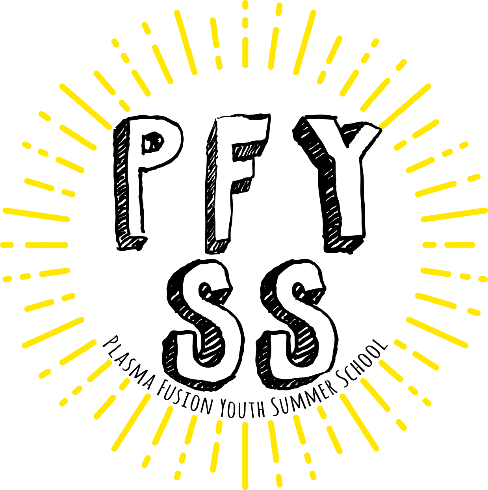

# プラズマ・核融合 若手夏の学校 HP

プラズマ・核融合 若手夏の学校ホームページのソースコードです。[https://pfyss.org](https://pfyss.org/)にて公開しています。 
プラズマ・核融合 若手夏の学校 (**P**lasma **F**usion **Y**outh **S**ummer **S**chool: **PFYSS**) は、学生・若手研究者たちがプラズマ・核融合の研究について学び、交流するためのイベントです。

## ライセンス

このリポジトリのソースコードは MIT ライセンスのもとで公開していますが、Createx Studio社のテンプレート [Silicon – Business / Technology Template + UI Kit](https://themes.getbootstrap.com/product/silicon-business-technology-template-ui-kit/)の Standard License に従っています。

## 運営

プラズマ・核融合若手夏の学校の HP は、[プラズマ・核融合 若手フォーラム](https://www.jspf.or.jp/wakate/)が運営しています。

# 開発者向け情報

本ホームページは、[Hugo](https://gohugo.io/)という静的サイトジェネレータを使用しています。また、[GitHub Pages](https://pages.github.com/)を利用してWebホスティングしています。詳しくはPFYSSの[wikiページ](https://github.com/plasma-fusion-youth-forum/pfyss/wiki)を参照してください。
