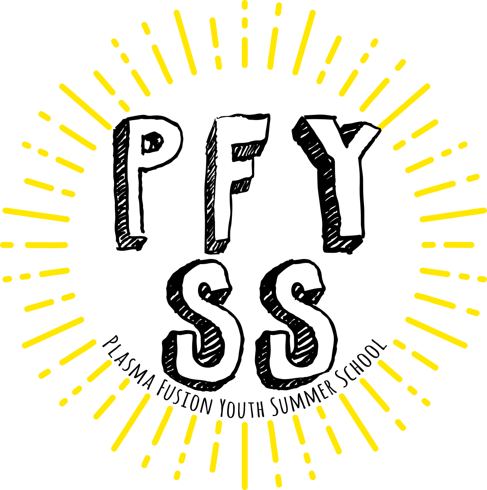

# プラズマ・核融合 若手夏の学校 HP

<div align="center">



[![CI][ci-badge]][ci]
[![Deploy][deploy-badge]][deploy]
[![code style: prettier][prettier-badge]][prettier]

</div>

[ci]: https://github.com/plasma-fusion-youth-forum/pfyss/actions/workflows/ci.yaml
[ci-badge]: https://img.shields.io/github/actions/workflow/status/plasma-fusion-youth-forum/pfyss/ci.yaml?style=flat-square&logo=GitHub&label=CI
[deploy]: https://github.com/plasma-fusion-youth-forum/pfyss/actions/workflows/hugo.yaml
[deploy-badge]: https://img.shields.io/github/actions/workflow/status/plasma-fusion-youth-forum/pfyss/hugo.yaml?style=flat-square&logo=GitHub&label=Deploy
[prettier]: https://github.com/prettier/prettier
[prettier-badge]: https://img.shields.io/badge/code_style-prettier-ff69b4.svg?style=flat-square

---

プラズマ・核融合 若手夏の学校ホームページのソースコードです。[https://pfyss.org](https://pfyss.org/)にて公開しています。<br>
プラズマ・核融合 若手夏の学校 (**P**lasma **F**usion **Y**outh **S**ummer **S**chool: **PFYSS**) は、学生・若手研究者たちがプラズマ・核融合の研究について学び、交流するためのイベントです。

## ライセンス

このリポジトリのソースコードは MIT ライセンスのもとで公開していますが、Createx Studio社のテンプレート [Silicon – Business / Technology Template + UI Kit](https://themes.getbootstrap.com/product/silicon-business-technology-template-ui-kit/)の Standard License に従っています。

## 運営

プラズマ・核融合若手夏の学校の HP は、[プラズマ・核融合 若手フォーラム](https://www.jspf.or.jp/wakate/)が運営しています。

# 開発者向け情報

本ホームページは、[Hugo](https://gohugo.io/)という静的サイトジェネレータを使用しています。また、[GitHub Pages](https://pages.github.com/)を利用してWebホスティングしています。詳しくはPFYSSの[wikiページ](https://github.com/plasma-fusion-youth-forum/pfyss/wiki)を参照してください。

## Quick Start

[`pixi`](https://pixi.sh/)をインストールした後、以下のコマンドを実行すると、ローカル環境で開発を開始できます。

```bash
$ git clone https://github.com/plasma-fusion-youth-forum/pfyss.git
$ cd pfyss
$ pixi run get-start
```

このコマンドは、リポジトリをクローンし、必要な依存関係をインストールし、ローカルサーバーを起動します。
その他のコマンドや開発に関する詳細は、[wikiページ](https://github.com/plasma-fusion-youth-forum/pfyss/wiki)を参照してください。
